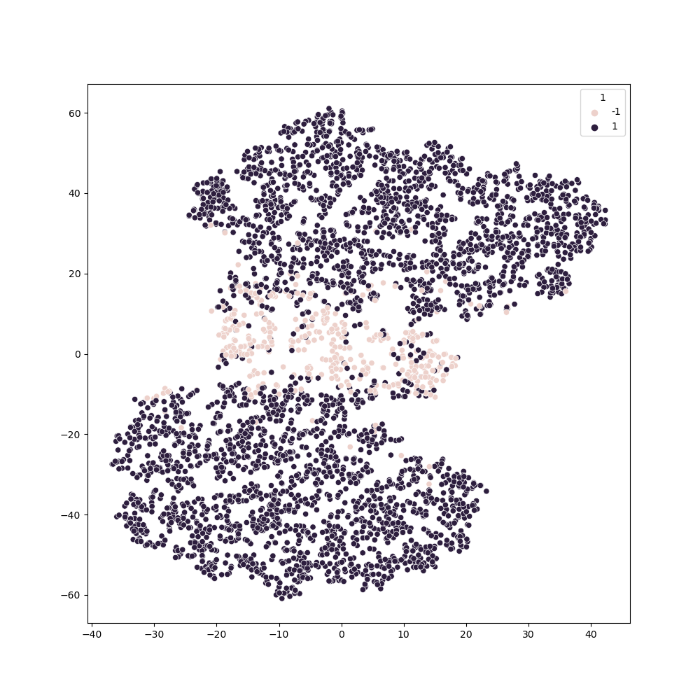
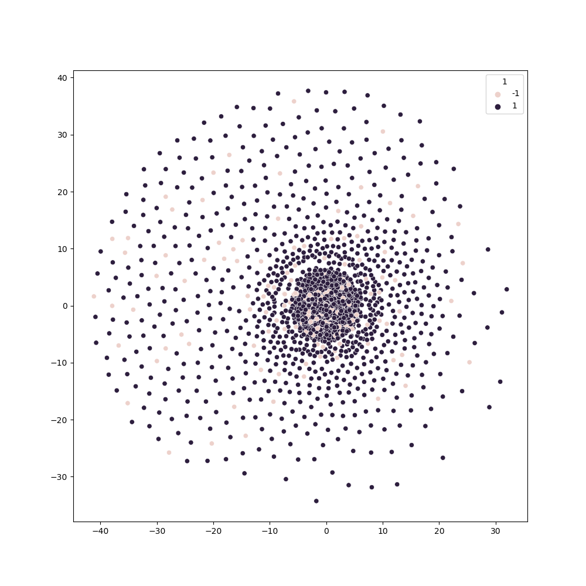
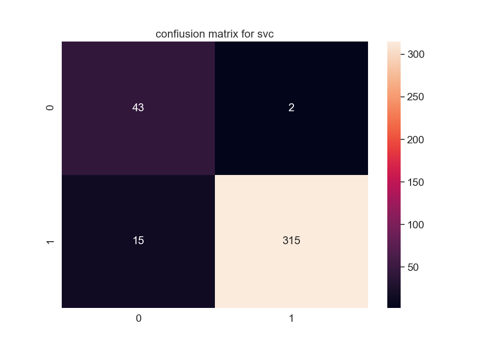
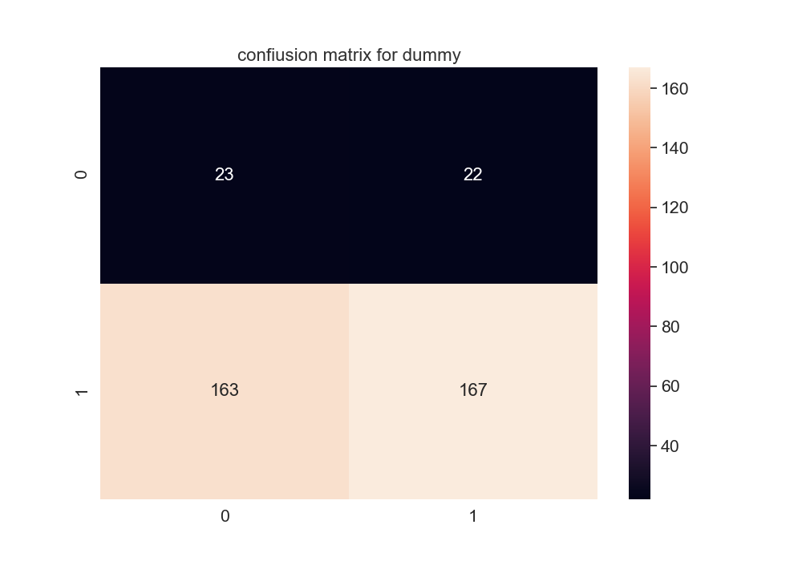

#  Predicting Labels For Unbalanced Data Set: Project Overview
* Predicted lables values of large (3750, 10000) imbalanced (1:3375, -1:375) dataset (F1 score ~ 0.92)
* Optimized SVC, KNN, and Extra Trees Classifier using hyperopt-sklearn and LogisticRegression, SVC, RandomForestClassifier using RandomSearchCV to reach the best model.
#  Code and Resources Used:
* **Python Version:** 3.8
* pandas, numpy, sklearn, matplotlib, seaborn, joblib
* hyperopt-sklearn https://github.com/hyperopt/hyperopt-sklearn
* Markdown-Cheatsheet https://github.com/adam-p/markdown-here/wiki/Markdown-Cheatsheet
* machinelearningmastery https://machinelearningmastery.com/framework-for-imbalanced-classification-projects/
* machinelearningmastery https://machinelearningmastery.com/fbeta-measure-for-machine-learning/

# Metric
* f1_score

#  EDA
**Standard deviation is high and mean values have excessive variance.** 

|    0          |      1        |      2   |     3       |      4      |     5  |   ...    |
| ------------- |:-------------:| -----:| ------------- |:-------------:| -----:| -----:|
| count         | 3750.000000   | 3750.000000 | 	3750.000000    | 	3750.000000 | 3750.000000 | ...    |
| mean          | 	30.571124   |   	9.199832 | 178.755026     | 837.059166|   -182.034161 | ...    |
| std           | 	286.17565   |    213.070740 | 	43667.290847| 57108.922663     |   	21944.043101| ...    |
| min           |-989.450000    |    -859.922000 | -163336.428000 | -243844.632000     |   -77566.109000	 | ...    |
| 25%           | 	-163.862000 |    -135.333000 | -29259.560000 | -38027.475000      |   -14405.498000 | ...    |
| 50%           | 35.463000      |    2.744000 | 1208.590000 |	1037.514000     |   -147.659000 | ...    |
| 75%           | 215.740000     |    156.269000 | 	29640.573000 |	40569.974000      |    14526.865000| ...    |
| 75%           | 	1224.394000    |    722.868000 | 177744.241000 | are neat      |    86287.955000 | ...    |

**Imbalance in the data set is about 10% - 90%.** 

|      | value counts   |
| ------------- |:-------------:|
| 1        | 3375   |
| -1        | 	375   |

**There are no null values in the dataset.** 

`X.isnull().sum().sum() = 0` 

**Using the IsolationForest algorithm we find out that there are about 375 outliers in the dataset.** 

`Data set before outliers detection(3745, 10000)`

`Data set after outliers detection(3375, 10000)`

 **Visualize the data using pca+tesne pipeline.**

 **Visualize the data using standardscaler+pca+tesne pipeline.**

#  Model Building
Using the [framework for Spot-Checking Machine Learning Algorithms](https://machinelearningmastery.com/framework-for-imbalanced-classification-projects/) we picked few models that might work for our task.
Next splited the data into train and tests sets with a test size of 10%
 and evaluated models using F1 socre. We chose F1 socre because it is calculated as the harmonic mean of precision and recall, giving each the same weighting. It allows a model to be evaluated taking both the precision and recall into account using a single score, which is helpful when describing the performance of the model and in comparing models.

The models we have traied:
* SVC
* KNN
* Extra Trees Classifier
* Dummy Classiier(strategy='uniform') - for the baseline

# Models Performence
* SVC   

|               |   precision   |  recall  | f1-score      | support       |
| ------------- |:-------------:| -----:   | ------------- |:-------------:| 
|class -1       |  0.74         |  0.96    |   0.83        |    45         |
|     class 1   |     0.99      |   0.95   |   0.97        |    330        |
|   accuracy    |               |          |    0.95       |    375        |
|  macro avg    |  0.87         |   0.96   |   0.90        |    375        |
|weighted avg   |   0.96        |   0.95   |    0.96       |    375        |

F1 score `0.904`

* KNN 

|                |     precision |   recall      | f1-score |  support     |
| ------------- |:-------------:| -----:   | ------------- |:-------------:| 
|    class -1   |    0.78    |  0.71    |  0.74      |  45|
|     class 1  |     0.96   |   0.97   |   0.97    |   330|
|    accuracy   |           |          |   0.94   |    375|
|   macro avg  |     0.87   |   0.84   |   0.86   |    375|
|weighted avg    |   0.94   |   0.94   |   0.94   |    375|

F1 score `0.847`

* Extra Trees Classifier

|              |precision   | recall  |f1-score   |support|
| ------------- |:-------------:| -----:   | ------------- |:-------------:| 
 |   class -1    |   0.86  |    0.80    |  0.83    |   45|
 |    class 1     |  0.97   |  0.98     | 0.98   |    330|
|    accuracy     |         |           |  0.96  |     375|
|   macro avg   |    0.92    |  0.89     | 0.90   |    375|
|weighted avg      | 0.96   |   0.96     | 0.96     |  375|

 F1 score `0.902`

* Dummy Classifier(strategy='uniform') - for the baseline.

|          |    precision  |  recall  |f1-score |  support|
| ------------- |:-------------:| -----:   | ------------- |:-------------:| 
  |  class -1    |   0.10   |   0.42   |   0.16    |    45|
 |    class 1   |    0.85    |  0.46    |  0.60     |  330|
  |  accuracy    |           |         |   0.45    |   375|
|   macro avg    |   0.47    |  0.44   |   0.38    |   375|
|weighted avg    |   0.76   |   0.45   |   0.54    |   375|

F1 score `0.396`

* Dummy Classifier(strategy='stratified') - for the baseline.

|          |    precision  |  recall  |f1-score |  support|
| ------------- |:-------------:| -----:   | ------------- |:-------------:| 
  |  class -1    |   0.11   |   0.11   |   0.11    |    123|
 |    class 1   |    0.90    |  0.90    |  0.90     |  1115|
| avg/total    |   0.82   |   0.82   |   0.82    |   1238|

F1 score `0.82`

# Model with connected Neptune 
[RESULTS](https://app.neptune.ai/ml_cdv/predict-labels/experiments?split=tbl&dash=charts&viewId=standard-view)

For Neptune, we built a separate model using Pipeline and using parameters for the following classifiers: LogisticRegression, SVC, RandomForestClassifier.

The model was computed using RandomizedSearchCV. The best model is the RandomForestClassifier with the following parameters: *{'classifier__n_estimators': 500, 'classifier__min_samples_split': 15, 'classifier__min_samples_leaf': 10, 'classifier__max_features': None, 'classifier__max_depth': 30, 'classifier': RandomForestClassifier(max_depth=30, max_features=None, min_samples_leaf=10, min_samples_split=15, n_estimators=500, random_state=42)}*

For preprocessing, we used PCA(n_components=0.95) and MinMaxScaler.

Best model result: f1_score = 0.92

Confusion matrix:
| | P | N |
|----|-----|--|
| P| 106      | 17      |
| N| 15       | 	1100   |

# Predicted labels 
CSV file with predicted labels by model with RandomizedSearchCV are available in branch mf_model.

# Conclusion
As a result, we have two strong models that give a score >90%. During data training we had some challenges with parameter completion (for example, when building a new model, we would definitely focus on finding the right metrics for a boosting classifier like XGBoost or CatBoost, because they can have high scores). It is possible that we would also change the metric when building the new model. A potential one is accuracy.
