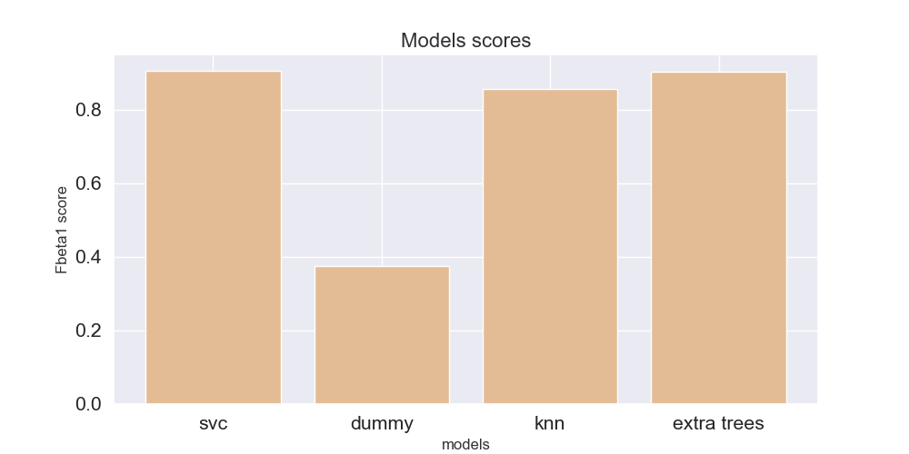

#  Predicting Lables For Unbalanced Data Set: Project Overview
* Predicted lables values of large (3749, 10000) imbalanced (1:3374, -1:375) data set (F2 socre ~ 0.93)
* Optimized SVC, KNN, and Extra Trees Classifier using hyperopt-sklearn to reach the best model.
#  Code and Resources Used:
* **Python Version:** 3.8
* pandas, numpy, sklearn, matplotlib, seaborn, joblib
* hyperopt-sklearn https://github.com/hyperopt/hyperopt-sklearn
* Markdown-Cheatsheet https://github.com/adam-p/markdown-here/wiki/Markdown-Cheatsheet
* machinelearningmastery https://machinelearningmastery.com/framework-for-imbalanced-classification-projects/
#  EDA

|      | 304.361       | -436.590 | -33854.769       | -96571.569          | -15086.947| ...    |
| ------------- |:-------------:| -----:| ------------- |:-------------:| -----:| -----:|
| count         | 3749.000000   | 3749.000000 | 	3749.000000    | 	3749.000000 | 3749.000000 | ...    |
| mean          | 	30.571124   |   	9.199832 | 178.755026     | 837.059166|   -182.034161 | ...    |
| std           | 	286.17565   |    213.070740 | 	43667.290847| 57108.922663     |   	21944.043101| ...    |
| min           |-989.450000    |    -859.922000 | -163336.428000 | -243844.632000     |   -77566.109000	 | ...    |
| 25%           | 	-163.862000 |    -135.333000 | -29259.560000 | -38027.475000      |   -14405.498000 | ...    |
| 50%           | 35.463000      |    2.744000 | 1208.590000 |	1037.514000     |   -147.659000 | ...    |
| 75%           | 215.740000     |    156.269000 | 	29640.573000 |	40569.974000      |    14526.865000| ...    |
| 75%           | 	1224.394000    |    722.868000 | 177744.241000 | are neat      |    86287.955000 | ...    |

|      | value counts   |
| ------------- |:-------------:|
| 1        | 3374   |
| -1        | 	375   |

 **wizualize the data using pca+tesne pipeline**

 **wizualize the data using standardscaler+pca+tesne pipeline**

#  Model Building
First, we splited the data into train and tests sets with a test size of 10%.
We few different models and evaluated them using F2 socre. We chose F2 socre because it gives less weight to precision and more weight to recall in the calculation of the score.
It is a useful metric to use when both precision and recall are important but slightly more attention is needed for false negatives.
The models we have traied:
* SVC
* KNN
* Extra Trees Classifier
* Dummy Classiier(strategy='uniform') - for the baseline

# H2 Models Preformence
* SVC 0.932

* KNN 0.847

* Extra Trees Classifier 0.895

* Dummy Classiier(strategy='uniform') - for the baseline 0.396

The SVC model outperformed the other approaches on the test and validation sets. Preditcing almost perfectly minority class. But having a fiew more False positives

# Predicted lables 
